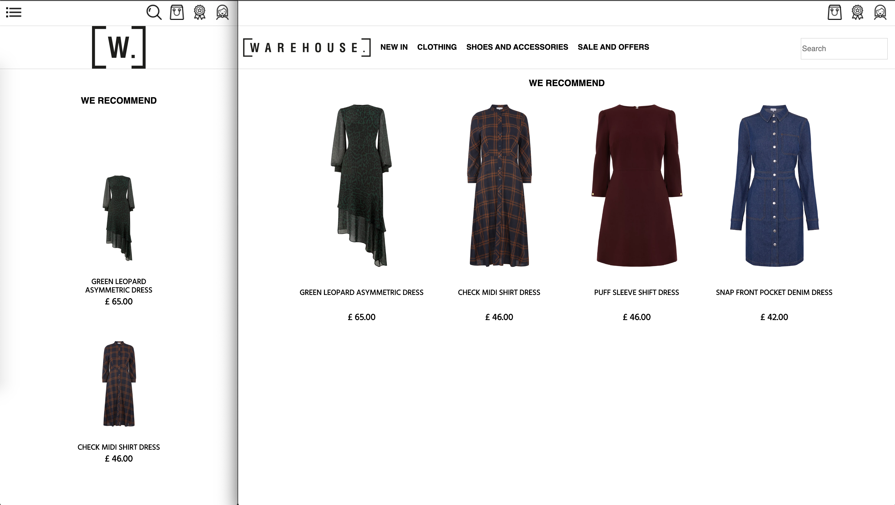

# Warehouse Software Engineer Exercise

## Breifing:
This website is built on the current version of React (16.7) and is purely a HTML(JSX), CSS and JavaScript website.

Webpack is used to provide a dev-server environment.

As this project did not require any backend, no other services are running.

Most media is local, however some assets (brand logo) are remote, so for best results please maintain an internet connection while testing.

## Instructions:
Having downloaded the repository please be sure to run 
`npm install` to install all packages from the package.json file.

No backend or express server is needed as JSON is loaded locally, simply run `npm run front` to start the webpack dev server. 

I've configured webpack to run dev-server on port `4000`. Please make sure your port is not in use before initialising, or feel free to re-configure to a prefered port.

#### How should this website look?
This website has passed tests on Google Chrome, Safari Web on Mac OS and Safari Mobile on iOS.

Example of Mobile (left) and Desktop views (right)

## How to use this website:
The recommended products are mapped out in a horizontal scrolling (vertical for mobile) container.

Each product card is within a re-usable react component. Simply click on an image to load the product Lightbox for more information about the product.

The Lightbox is another re-usable React component, each component comes loaded with a pure-react carousel, as well as a template to display data about each product.

Every colour variety in the Lightbox product view, when clicked, will update the carousel with the new data for the respective color, maintaining your position in the carousel, so you can compare the differences between each product color variety more accurately.

To exit the Lightbox, you can simply click away from it, or hit the Esc key. If you're in mobile view, there is an exit cross in the top right corner.